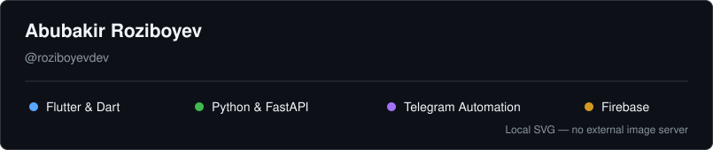

# Abubakir Roziboyev

Hello, I'm Abubakir, a software developer focused on mobile and backend development.

I build practical applications using Flutter for mobile development and Python for backend systems. I also work with APIs, Telegram bots, automation tools, and application architecture.

### Areas of Focus

- **Mobile Development:** Building cross-platform applications for Android and iOS using Flutter and Dart.
- **Backend Development:** Creating REST APIs and backend services using Python and FastAPI.
- **Automation:** Developing Telegram bots and automation tools with Aiogram and Telethon.
- **Development Tools:** Working with Git, Linux, Docker, Firebase, and CI/CD workflows.

### Tech Stack

- **Languages:** Dart, Python
- **Mobile:** Flutter
- **Backend:** FastAPI
- **State Management:** Riverpod, Bloc, Provider
- **API and Database:** REST API, Dio, Firebase, SQLite
- **Architecture:** Clean Architecture, SOLID
- **Tools:** Git, Linux, Docker, CI/CD

### GitHub Metrics

 

  

### Contact

You can contact me through the links below:

[Telegram](https://t.me/abubakr_roziboyev) •
[Instagram](https://instagram.com/abubakr.roziboyev) •
[GitHub](https://github.com/roziboyevdev)
